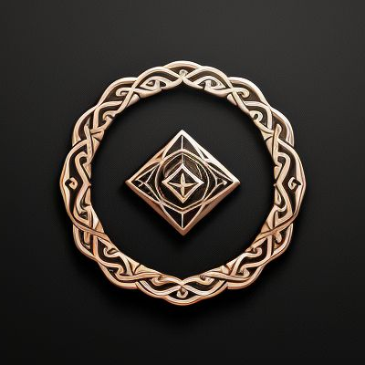

  

# Survace ✨
> One Ring to rule them all...  
> In a good way.

## About 📖
Have you ever found an app `UI` lacking or limited?  
Have you ever googled how to delete 10 apps at once or 
how to perform some specific task the developers did 
not provide _out-of-the-box_?  
Let the dark magic of `Survace` be of use to you.

## Goal 🎯
`Survace` is a service designed to make other 
services accomplish things they were always capable 
of, but never willing to do for you.

## How does it work? 🛠️
This service enables users to perform specific tasks 
on a service of their choosing.

## Content 📋
The current implementation provides access to `YouTube`
service through the interface of a `Telegram` bot.

### Available Services:
- YouTube 📺

### Available UI:
- Telegram Bot 🤖

## Links 🔗
[Telegram Bot](https://t.me/survace_bot)

---

Feel free to contribute or suggest new features! 🌟